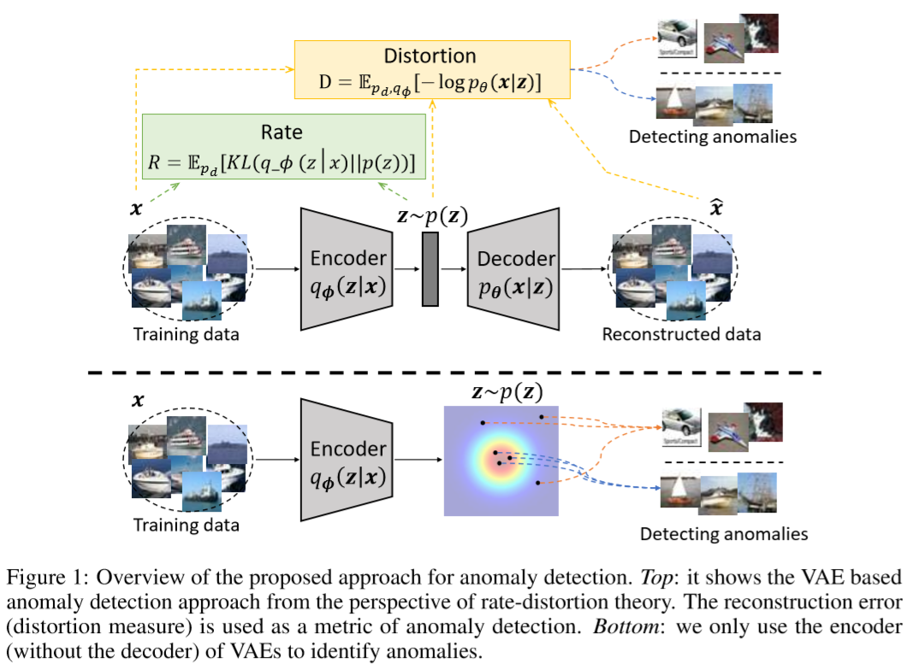
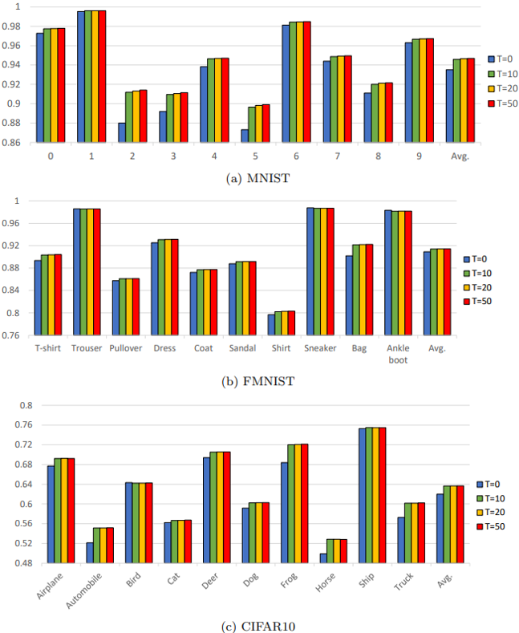
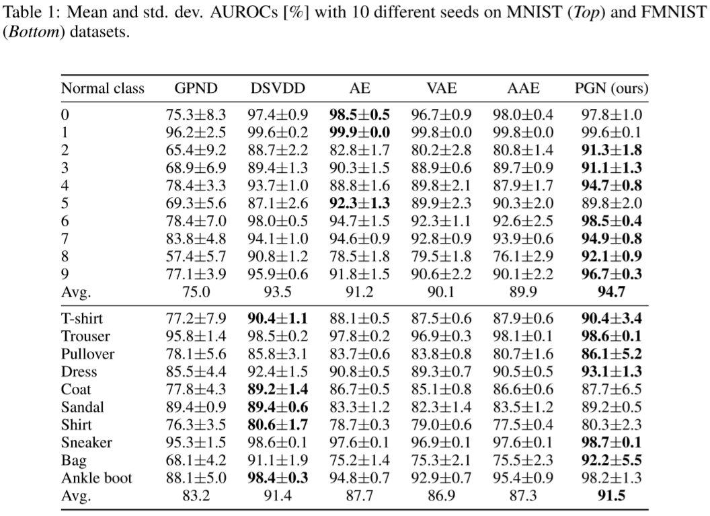
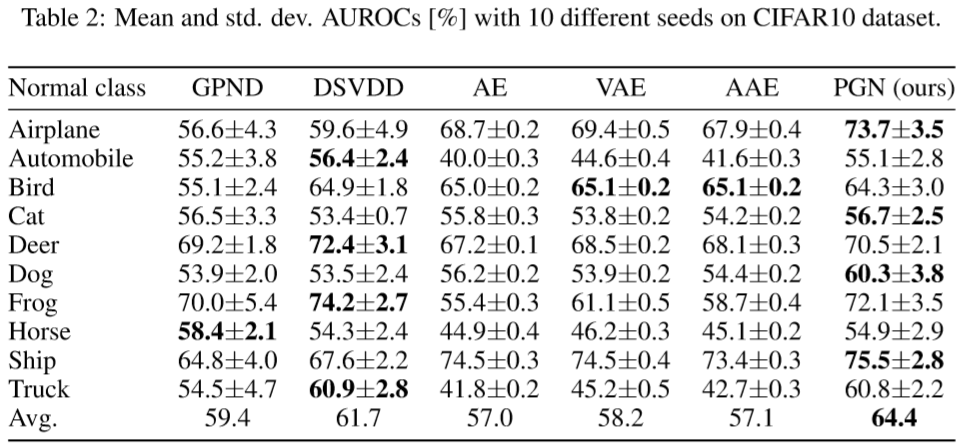

## PGN 
### : Prior Generating Networks for Anomaly Detection

<div align="center">
  
</div>

### [Preprint[pdf]](https://arxiv.org/pdf/2005.01889)
> **Interpreting Rate-Distortion of Variational Autoencoder and Using Model Uncertainty for Anomaly Detection**<br>
> **Seonho Park** (U. of Florida), George Adosoglou (U. of Florida), Panos M. Pardalos (U. of Florida)
>
> **Abstract** *Building a scalable machine learning system for unsupervised anomaly detection via representation learning is highly desirable. One of the prevalent methods is using a reconstruction error from variational autoencoder (VAE) via maximizing the evidence lower bound. We revisit VAE from the perspective of information theory to provide some theoretical foundations on using the reconstruction error, and finally arrive at a simpler and more effective model for anomaly detection. In addition, to enhance the effectiveness of detecting anomalies, we incorporate a practical model uncertainty measure into the metric. We show empirically the competitive performance of our approach on benchmark datasets.*


## Requirements
* python == 3.7.3
* pytorch == 1.0.1

## Execution - Anomaly Detection

```bash
python main_pgn.py
```

- Tested on CIFAR10, FMNIST, MNIST Datasets
- one could find some options in `utils.py`
- other methods (GPND, DSVDD, AE, VAE, AAE) can be executed in a similar way with execution files `main_dsvdd.py`, `main_gpnd.py` and so on.


## Execution - beta-VAE for rate-distortion analysis

```bash
python beta_vae_test.py
```

## Results
### AblAtion study

<div align="center">
  
</div>

### Anomaly detection on MNIST & FMNIST

<div align="center">
  
</div>

### Anomaly detection on CIFAR10

<div align="center">
  
</div>


## Citation 
If you want to cite this, please refer to the following:
```
@article{park2020anomaly,
  title={Interpreting Rate-Distortion of Variational Autoencoder and Using Model Uncertainty for Anomaly Detection},
  author={Park, Seonho and Adosoglou, George and Pardalos, Panos M},
  journal={arXiv preprint arXiv:2005.01889},
  year={2020}
}
```